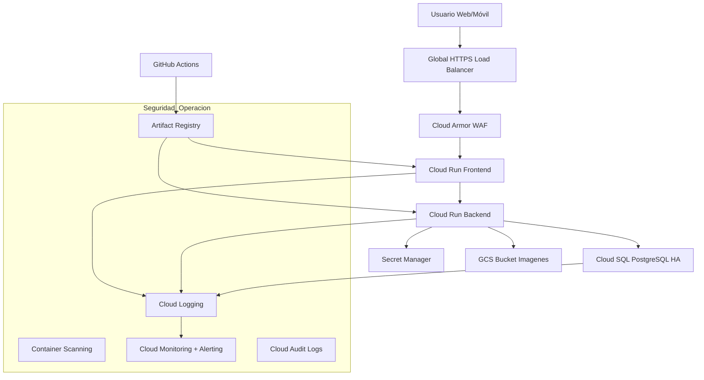

# Arquitectura Objetivo GCP — Entrega 2

## 1. Objetivo

Definir una arquitectura productiva en GCP para LiveMenu que cumpla la Entrega 2:

- Alta disponibilidad (objetivo 99.9%)
- Integridad y continuidad de datos
- Seguridad avanzada (cifrado, secretos, WAF, escaneo de contenedores)
- Infraestructura como código

---

## 2. Decisiones de arquitectura (GCP)

### 2.1 Cómputo

- Backend: Cloud Run (servicio privado, solo tráfico interno desde LB)
- Frontend: Cloud Run (servicio público detrás de Load Balancer)
- Contenedores almacenados en Artifact Registry

### 2.2 Datos

- PostgreSQL administrado en Cloud SQL for PostgreSQL
- Configuración HA regional (alta disponibilidad)
- Backups automáticos diarios con retención de 15 días

### 2.3 Archivos e imágenes

- Google Cloud Storage para imágenes
- Versionamiento habilitado
- Manejo de variantes: `thumbnail`, `medium`, `large`

### 2.4 Seguridad y perímetro

- HTTPS obligatorio en Load Balancer (certificado administrado)
- Cloud Armor como WAF (OWASP + rate limiting)
- Secret Manager para secretos (sin `.env` en producción)
- IAM con principio de menor privilegio

### 2.5 IaC

- Terraform como fuente única de verdad para infraestructura

---

## 3. Diagrama lógico



---

## 4. Organización de componentes

## 4.1 Componentes cloud

- Networking
- Global HTTPS Load Balancer
- Cloud Armor (WAF)
- Serverless NEG hacia Cloud Run

- Aplicación
- Servicio Cloud Run `livemenu-frontend`
- Servicio Cloud Run `livemenu-backend`

- Datos
- Instancia Cloud SQL PostgreSQL (HA)
- Bucket GCS `livemenu-images-<env>` con versionamiento

- Seguridad
- Secret Manager para JWT, DB URL, API keys
- IAM service accounts dedicadas por servicio
- KMS (opcional recomendado) para llaves de cifrado administradas por cliente

- Observabilidad
- Cloud Logging
- Cloud Monitoring (SLO, uptime checks, alertas)
- Error Reporting

## 4.2 Organización de infraestructura en el repositorio

Estructura propuesta para separar por dominio y ambiente:

```text
infra/
  terraform/
    modules/
      network/
      cloud_run_service/
      cloud_sql/
      storage/
      secret_manager/
      load_balancer/
      cloud_armor/
      monitoring/
    envs/
      dev/
        main.tf
        variables.tf
        terraform.tfvars
      stg/
        main.tf
        variables.tf
        terraform.tfvars
      prod/
        main.tf
        variables.tf
        terraform.tfvars
```

## 4.3 Organización de configuración de aplicación

- Backend (`ApiRestaurante`)
- Configurar lectura de secretos desde variables inyectadas por Cloud Run
- Mantener compatibilidad local con `.env` solo para desarrollo
- Configuración de conexión a Cloud SQL mediante `DATABASE_URL`

- Frontend (`AppRestaurante`)
- Configurar endpoint backend por entorno (`BACKEND_API_URL`)
- Configurar bucket y políticas de subida/lectura de imágenes

---

## 5. Modelo de seguridad (alineado al enunciado)

## 5.1 Cifrado

- En tránsito
- TLS 1.2+ en el Load Balancer
- Tráfico interno servicio a servicio por canales seguros gestionados por GCP

- En reposo
- Cloud SQL cifrado por defecto
- GCS cifrado por defecto
- Recomendado: CMEK con Cloud KMS para mayor control

## 5.2 Gestión de secretos

- Todos los secretos en Secret Manager
- Sin secretos en repositorio ni en imágenes
- Rotación automática cada 40 días (scheduler + función o rotación gestionada según secreto)
- Acceso por IAM mínimo necesario por cuenta de servicio

## 5.3 Seguridad de contenedores

- Build de imagen en CI
- Escaneo de vulnerabilidades en Artifact Registry
- Política de bloqueo de despliegue si hay vulnerabilidades críticas
- Imágenes base mínimas y actualizadas

## 5.4 WAF

- Cloud Armor con reglas preconfiguradas para OWASP Top 10
- Rate limiting en rutas sensibles (`/auth`, `/admin`, APIs públicas)
- Geoblocking opcional según necesidad de negocio

---

## 6. Continuidad y disponibilidad

- Disponibilidad objetivo: 99.9%
- Cloud SQL en configuración HA regional
- Backups automáticos diarios (15 días)
- Versionamiento activo en GCS
- Definir y documentar:
- RPO objetivo: <= 24 horas
- RTO objetivo: <= 4 horas

Pruebas mínimas de continuidad:

- Restaurar backup de Cloud SQL en instancia de prueba
- Recuperar versión anterior de imagen en GCS
- Validar procedimiento de failover y recuperación

---

## 7. Flujo de despliegue (alto nivel)

1. Merge a rama principal
2. CI ejecuta tests y quality gates
3. Build de contenedores frontend/backend
4. Push a Artifact Registry
5. Escaneo de vulnerabilidades
6. Terraform plan/apply (entorno objetivo)
7. Deploy a Cloud Run con nueva imagen
8. Smoke tests y verificación de salud

---

## 8. Plan de implementación por etapas

## Etapa A: Base de infraestructura

- Proyecto GCP, IAM, Artifact Registry, buckets, Secret Manager
- Cloud SQL HA y conectividad segura

## Etapa B: Despliegue de servicios

- Backend en Cloud Run
- Frontend en Cloud Run
- Integración FE -> BE

## Etapa C: Perímetro y seguridad avanzada

- Load Balancer HTTPS
- Cloud Armor (OWASP + rate limiting)
- Endurecimiento de IAM y secretos

## Etapa D: Continuidad y operación

- Backups, versionamiento y pruebas de restauración
- Dashboards y alertas
- Documentación y evidencias para entrega

---

## 9. Evidencias requeridas para la entrega

- Diagrama de arquitectura final en GCP
- Capturas de Cloud Run, Cloud SQL HA, GCS versionado
- Configuración de cifrado y TLS
- Evidencia de Secret Manager y política de rotación
- Reporte de vulnerabilidades de imágenes
- Evidencia de WAF (reglas + pruebas)
- Video demostrativo del flujo end-to-end

---

## 10. Checklist de aceptación

- [ ] Frontend y backend desplegados en GCP y operativos
- [ ] Base de datos en Cloud SQL con alta disponibilidad
- [ ] Storage en GCS con variantes de imagen y versionamiento
- [ ] Cifrado en tránsito y en reposo validado
- [ ] Secretos fuera de `.env` y con rotación definida
- [ ] WAF activo con reglas OWASP y rate limiting
- [ ] Escaneo de contenedores integrado en pipeline
- [ ] Backups automáticos y prueba de restauración completada
- [ ] Evidencias documentadas para cada criterio de evaluación
