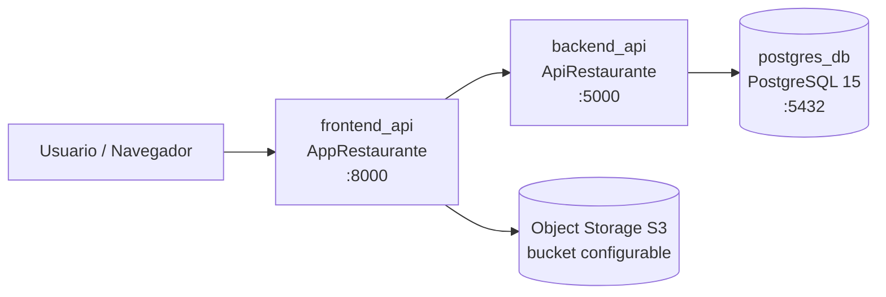
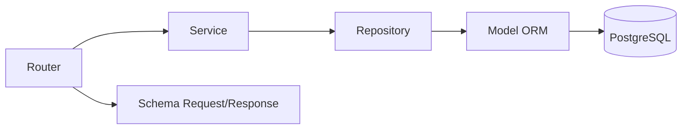

# Mapa de Arquitectura — Proyecto  Restaurante

## 1) Vista general

El workspace contiene **dos aplicaciones FastAPI** y una base de datos PostgreSQL, orquestadas por Docker Compose:

- `ApiRestaurante`: API backend (lógica de negocio + acceso a base de datos).
- `AppRestaurante`: aplicación web FastAPI (renderizado de templates + consumo de la API backend).
- `postgres_db`: almacenamiento relacional principal.

Adicionalmente, `AppRestaurante` puede integrarse con **Object Storage compatible S3** para carga de imágenes.

---

## 2) Topología de despliegue (docker-compose)



Servicios declarados en `docker-compose.yml`:

- `postgres_db` expone `5432:5432`.
- `backend_api` construye desde `./ApiRestaurante` y expone `5001:5000`.
- `frontend_api` construye desde `./AppRestaurante` y expone `8000:8000`.

---

## 3) Arquitectura interna por aplicación

### 3.1 ApiRestaurante (Backend API)

Estructura por capas (estilo clean/layered):

- **Routers** (`app/routers/`): endpoints HTTP (`auth`, `admin_*`, `public_menu`).
- **Services** (`app/services/`): casos de uso y reglas de negocio.
- **Repositories** (`app/repositories/`): acceso a datos vía SQLAlchemy.
- **Models** (`app/models/`): entidades ORM.
- **Schemas** (`app/schemas/`): contratos de entrada/salida (Pydantic).
- **Core/Utils** (`app/core`, `app/utils`): seguridad, JWT, utilidades transversales.
- **DB** (`app/db.py`): engine, sesión y base declarativa.

Flujo típico:



### 3.2 AppRestaurante (Web + BFF ligero)

Responsabilidades principales:

- Renderizado HTML con Jinja2 (`app/templates/`).
- Middleware JWT basado en cookie/token para proteger rutas.
- Consumo de API backend mediante `settings.BACKEND_URL` (`http://backend_api:5000/api/v1/`).
- Gestión opcional de archivos en S3 (`app/services/storage.py`).

Capas principales:

- **Routers web** (`app/routers/`): autenticación, restaurantes, categorías, platos, uploads, menú público.
- **Services** (`app/services/`): lógica de UI y llamadas a backend/storage.
- **Core** (`app/core/`): configuración y seguridad.
- **UI/Templates** (`app/ui`, `app/templates`, `app/static`): presentación.

---

## 4) Flujos clave del sistema

### 4.1 Autenticación

1. Usuario accede a `frontend_api`.
2. `AppRestaurante` valida token (header o cookie) en middleware.
3. Si requiere login, se usa router de auth (`/api/v1/auth`) y se obtiene JWT.
4. JWT habilita acceso a rutas protegidas y operaciones administrativas.

### 4.2 Gestión administrativa (restaurantes/categorías/platos)

1. UI en `AppRestaurante` recibe interacción del usuario.
2. Frontend llama a endpoints del `ApiRestaurante`.
3. Backend procesa por capas `router -> service -> repository -> PostgreSQL`.
4. Respuesta vuelve al frontend para renderizado de templates.

### 4.3 Menú público

1. Usuario navega rutas públicas de menú.
2. `AppRestaurante`/`ApiRestaurante` exponen datos sin requerir flujo administrativo completo.
3. Si hay imágenes en S3, se usan URLs públicas o prefirmadas para visualización.

---

## 5) Mapa de módulos del workspace

```text
Proyecto_dev_sec_ops/
├─ docker-compose.yml
├─ ApiRestaurante/
│  ├─ app/
│  │  ├─ routers/          # Endpoints backend
│  │  ├─ services/         # Lógica de negocio
│  │  ├─ repositories/     # Acceso a datos
│  │  ├─ models/           # ORM SQLAlchemy
│  │  ├─ schemas/          # DTOs/Pydantic
│  │  ├─ core/ utils/      # Seguridad/JWT/helpers
│  │  └─ db.py             # Configuración PostgreSQL
│  └─ tests/               # Pruebas unitarias por capa
└─ AppRestaurante/
   ├─ app/
   │  ├─ routers/          # Endpoints web + acciones UI
   │  ├─ services/         # Integración backend + S3
   │  ├─ core/             # Config y seguridad
   │  ├─ templates/        # Vistas HTML
   │  ├─ static/           # CSS/imagenes
   │  └─ ui/               # Helpers de presentación
   └─ tests/               # Pruebas de servicios
```

---

## 6) Consideraciones DevSecOps observables

- Separación de responsabilidades entre frontend web y backend API.
- Uso de JWT para control de acceso.
- Variables de entorno para secretos e integración cloud (S3/AWS).
- Persistencia desacoplada en contenedor PostgreSQL con volumen.
- Cobertura de pruebas por servicios/repositorios en ambos proyectos.

---

## 7) Recomendación de evolución del mapa

Si quieres, este mapa puede extenderse con:

- Diagrama de secuencia por caso de uso (login, crear plato, subir imagen).
- Matriz de amenazas (STRIDE) por componente.
- Mapa de controles DevSecOps por etapa de CI/CD.

---

## 8) Manual de deployment

### 8.1 Prerrequisitos

- Docker y Docker Compose instalados en el host.
- Puertos disponibles: `8000` (frontend), `5001` (backend), `5432` (PostgreSQL).
- Archivo de variables de entorno preparado desde plantilla:

```powershell
Copy-Item .env.example .env
```

> Nota de seguridad: no publicar credenciales reales en repositorio. Gestionar secretos fuera del control de versiones.

### 8.2 Despliegue de servicios

Desde la raíz del proyecto (`Proyecto_dev_sec_ops/`):

```powershell
docker compose --env-file .env up -d --build
docker compose ps
```

Servicios esperados:

- `postgres_db` (PostgreSQL)
- `backend_api` (ApiRestaurante)
- `frontend_api` (AppRestaurante)

### 8.3 Restauración de base de datos (obligatoria para acceso inicial)

Para operar el sistema con datos iniciales, restaurar uno de los backups disponibles:

- `backup_complete.sql`
- `backup_complete.dump`

#### Opción A: restaurar desde SQL

```powershell
$DB_CONTAINER = docker compose ps -q postgres_db
docker cp .\backup_complete.sql "$DB_CONTAINER`:/tmp/backup_complete.sql"
docker compose exec postgres_db psql -U postgres -d Restaurante -f /tmp/backup_complete.sql
```

#### Opción B: restaurar desde DUMP

```powershell
$DB_CONTAINER = docker compose ps -q postgres_db
docker cp .\backup_complete.dump "$DB_CONTAINER`:/tmp/backup_complete.dump"
docker compose exec postgres_db pg_restore -U postgres -d Restaurante --clean --if-exists /tmp/backup_complete.dump
```

### 8.4 Validación post-despliegue

Validar tablas en la base restaurada:

```powershell
docker compose exec postgres_db psql -U postgres -d Restaurante -c "\dt"
```

Validar acceso funcional:

- Frontend: `http://localhost:8000`
- Backend API publicado: `http://localhost:5001`

### 8.5 Operación y recuperación

Comandos operativos comunes:

```powershell
# Ver logs en tiempo real
docker compose logs -f

# Reiniciar servicios
docker compose restart

# Detener conservando volumen de datos
docker compose down

# Detener y eliminar volumen (entorno limpio)
docker compose down -v
```

### 8.6 Troubleshooting mínimo

- Si falla conexión a base de datos, verificar estado de `postgres_db` con `docker compose ps`.
- Si el login no funciona tras desplegar, confirmar que la restauración de backup se ejecutó sin errores.
- Si hay error de puertos ocupados, cambiar mapeos en `docker-compose.yml` y recrear servicios.
