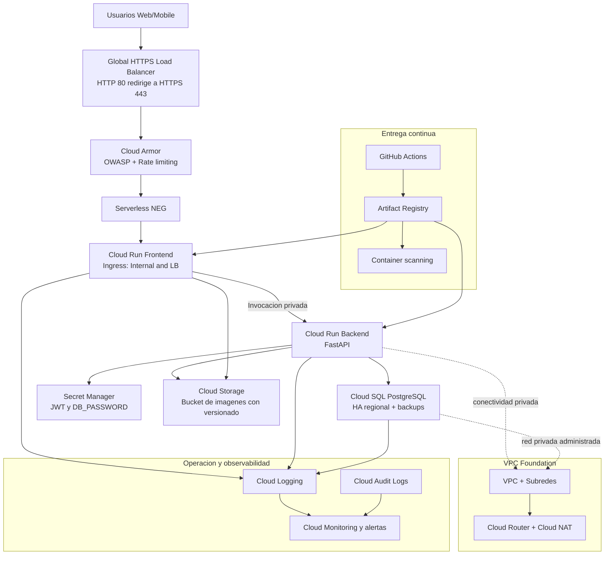
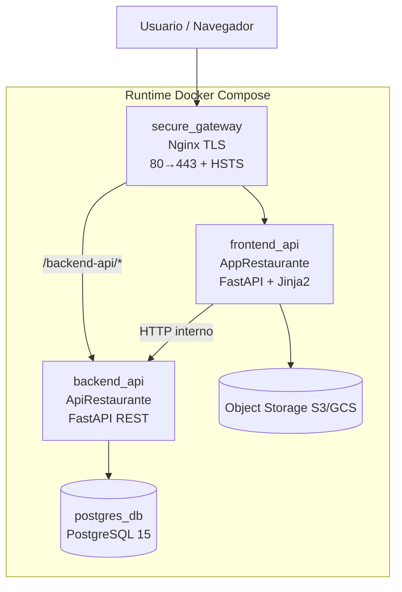
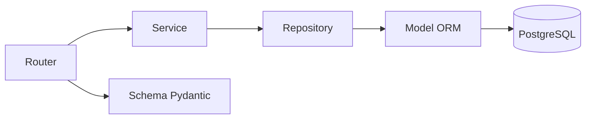
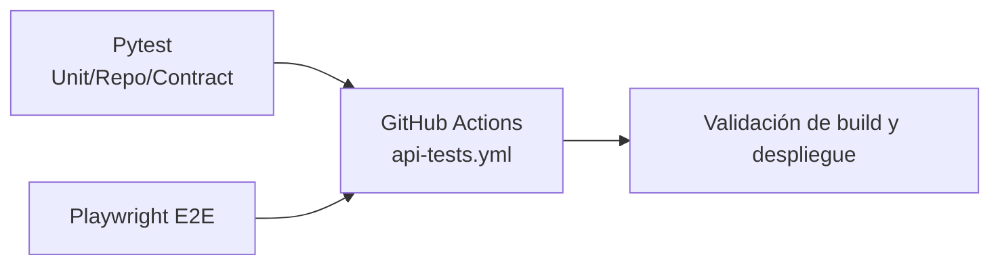

# Mapa de Arquitectura — Proyecto Restaurante

## 0) Diagrama de arquitectura actualizada en GCP

La arquitectura objetivo en GCP se soporta en Cloud Run para frontend/backend, con entrada por HTTPS Load Balancer, proteccion WAF con Cloud Armor y datos en Cloud SQL + Cloud Storage.

En el entorno `foundation-dev` actual, Terraform mantiene la base de red y seguridad (`create_frontend_lb=false`, `create_cloud_dns=false`, `create_waf_policy=true`) como despliegue por fases.



### Componentes implementados en Terraform

- Compute: Cloud Run frontend y backend.
- Perimetro: Global HTTP(S) Load Balancer + Serverless NEG + Cloud Armor.
- DNS: no implementado en el entorno actual (`create_cloud_dns=false`).
- Datos: Cloud SQL for PostgreSQL en modo regional (HA).
- Storage: bucket de imagenes en Cloud Storage con versionamiento.
- Seguridad: Secret Manager + cuentas de servicio con IAM de minimo privilegio.
- Red: VPC, subredes, Cloud Router y Cloud NAT.
- Entrega: Artifact Registry como registro de imagenes para despliegues desde CI.
- Estado `foundation-dev`: despliegue por fases con LB frontend y DNS deshabilitados por configuracion.

## 1) Vista general completa

La solución está organizada como una arquitectura web + API desacoplada, desplegada en contenedores y protegida con HTTPS.

Componentes principales:

- `secure_gateway` (Nginx): punto de entrada único, termina TLS, redirige HTTP→HTTPS y enruta tráfico.
- `frontend_api` (`AppRestaurante`): aplicación web FastAPI con renderizado de plantillas Jinja2.
- `backend_api` (`ApiRestaurante`): API REST FastAPI con reglas de negocio y acceso a datos.
- `postgres_db` (PostgreSQL): persistencia transaccional principal.
- `Object Storage` (integración S3/GCS): almacenamiento de imágenes de menú.

---

## 2) Topología de despliegue (actual)



### Puertos publicados al host

- `80:80` y `443:443` en `secure_gateway`.
- `5432:5432` en `postgres_db` (solo para operación/administración DB).
- `backend_api` y `frontend_api` se exponen internamente en la red Docker (`5000`, `8000`) sin publicación directa al host.

---

## 3) Arquitectura interna por capas

## 3.1 Backend (`ApiRestaurante`)

Arquitectura por capas:

- **Routers**: definen endpoints (`auth`, `admin_*`, `public_menu`).
- **Services**: contienen reglas de negocio.
- **Repositories**: encapsulan acceso a datos con SQLAlchemy.
- **Models**: entidades ORM para PostgreSQL.
- **Schemas**: contratos Pydantic de entrada/salida.
- **Core/Utils**: JWT, seguridad, utilidades transversales, cache.

Flujo estándar:



## 3.2 Frontend web (`AppRestaurante`)

Estructura de aplicación web con integración backend:

- **Routers web**: navegación, formularios y acciones de usuario.
- **Services**: integración con API backend y almacenamiento de objetos (S3/GCS).
- **Core**: configuración y seguridad.
- **UI**: plantillas Jinja2, archivos estáticos, helpers de presentación.
- **Middlewares**: protección por JWT/cookie y refuerzo HTTPS.

---

## 4) Seguridad y controles transversales

La arquitectura incorpora controles de seguridad en varios niveles:

- **Transporte seguro (RNF-03)**: TLS en `secure_gateway` con redirección HTTP→HTTPS.
- **Headers de seguridad**: HSTS y cabeceras defensivas en gateway.
- **Autenticación/Autorización**: JWT + validación de rutas administrativas.
- **Cookies seguras**: `Secure`/`SameSite` en sesión web.
- **Aislamiento de red**: backend/frontend no expuestos directamente al host.

---

## 5) Datos y almacenamiento

- **PostgreSQL**: almacena entidades de dominio (usuarios, restaurantes, categorías, platos).
- **Object Storage (S3/GCS)**: almacena archivos binarios (imágenes), evitando sobrecargar la base relacional.
- **Cache de menú**: mecanismo híbrido con memoria y soporte Redis opcional para optimizar lecturas públicas.

---

## 6) Calidad, pruebas y entrega continua

La arquitectura técnica incluye validación automatizada:

- **Pytest**:
  - Unitarias de servicios.
  - Repositorios.
  - Contrato API.
- **Playwright**: pruebas E2E del flujo web.
- **GitHub Actions**: pipeline para ejecutar tests, cobertura y E2E en entorno controlado.



---

## 7) Flujos funcionales principales

## 7.1 Login y sesión

1. Usuario entra por `https://localhost`.
2. Gateway termina TLS y enruta al frontend.
3. Frontend valida credenciales vía backend.
4. Backend emite token JWT.
5. Frontend establece sesión y habilita rutas protegidas.

## 7.2 Operación administrativa

1. Usuario admin interactúa con formularios en frontend.
2. Frontend consume endpoints administrativos del backend.
3. Backend procesa `router → service → repository → PostgreSQL`.
4. Frontend renderiza confirmaciones/errores según respuesta.

## 7.3 Menú público

1. Cliente consulta menú público vía frontend/backend.
2. Backend recupera datos de dominio.
3. Imágenes se sirven desde object storage (S3/GCS, URL pública o resuelta por frontend).

---

## 8) Mapa de módulos del repositorio

```text
Proyecto_dev_sec_ops/
├─ docker-compose.yml
├─ infra/
│  └─ nginx/
│     ├─ Dockerfile
│     ├─ nginx.conf
│     └─ entrypoint.sh
├─ ApiRestaurante/
│  ├─ app/
│  │  ├─ routers/
│  │  ├─ services/
│  │  ├─ repositories/
│  │  ├─ models/
│  │  ├─ schemas/
│  │  ├─ core/
│  │  └─ utils/
│  └─ tests/
├─ AppRestaurante/
│  ├─ app/
│  │  ├─ routers/
│  │  ├─ services/
│  │  ├─ core/
│  │  ├─ templates/
│  │  ├─ static/
│  │  └─ ui/
│  └─ tests/
├─ e2e/
│  ├─ tests/
│  └─ playwright.config.ts
└─ .github/workflows/
    ├─ api-tests.yml
    └─ terraform-infra.yml
```

---

## 9) Despliegue y validación operativa

### Despliegue

```powershell
docker compose --env-file .env up -d --build
docker compose ps
```

### Validación de conectividad

```powershell
curl -I http://localhost
curl -k https://localhost/ -o NUL -s -w "%{http_code}`n"
```

Resultados esperados:

- HTTP responde `301` hacia HTTPS.
- HTTPS responde `200` para la aplicación web.

---

## 10) Resumen arquitectónico

La arquitectura implementa separación por capas, seguridad de transporte, integración cloud para binarios, automatización de pruebas y operación reproducible con contenedores. Esto habilita evolución controlada, menor acoplamiento y mejor mantenibilidad en un enfoque DevSecOps.
